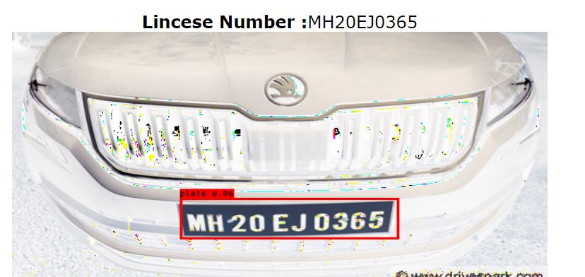
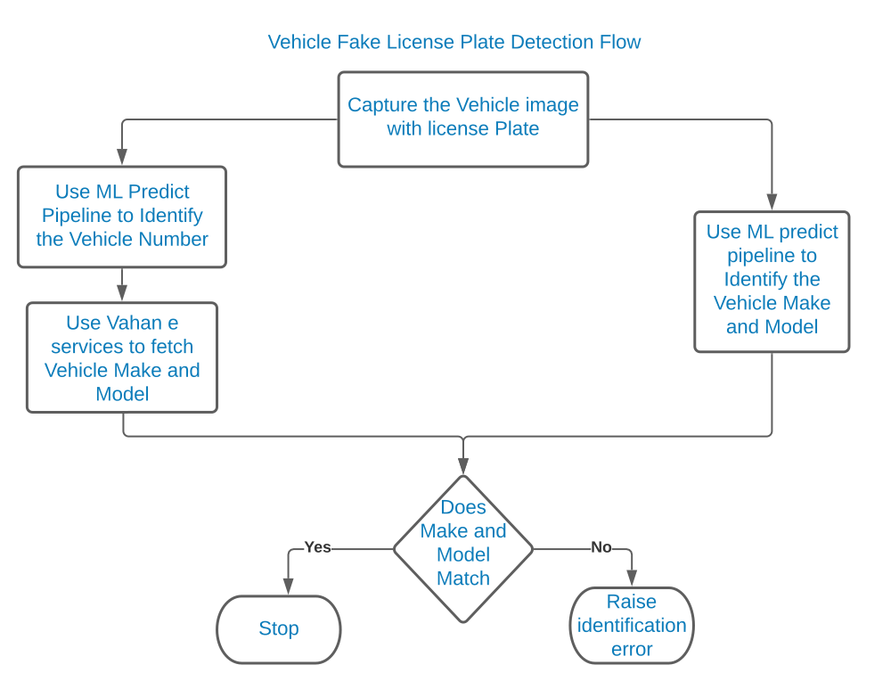
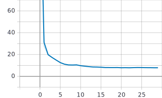
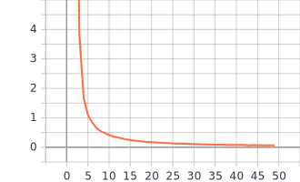
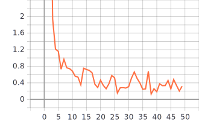

<h2>Vehicle Identification(Viden)</h2>

<h3>Demo App</h3>

The Demo app is hosted on Google Cloud. [Launch](https://viden-n6rafmjufa-el.a.run.app)

<h3>Sample Input Output</h3>
<table>
<tr>
<td> </td>
<td> </td>
</tr>
<tr>
<td>Input Image</td>
<td>Output Image</td>
</tr>
</table>

The goal is to create a service to detect fraud in license plate usage by way of 
1. Identifying vehicle  license plate number.
2. Vehicle make, model 
3. Use vehicle number from step 1 to fetch vehicle details from govt vehicle database 
   using Vahan e-services and flag any discrepancy found.
  
                   

Currently we have created deep learning model to detect and recognise car license plate number only due to resource constraints.
Even just for cars our tarining dataset was comparitively small (~300) car images downloaded from internet. For text detection 
model we used a synthetic dataset. The dataset size was ~50k images which is comparitively smaller.CRNN+CTC model was trained 
on 8Gib GPU. The training ,validation and test set were in 80:10:10 ratio in both models training. 

For YOLOv2 training we started with the pretrained weights of the Darknet and fine-tuned the model by changing the weights of 
the last two layers. The model is trained for 30 epochs used the learning rate , weight decay and momentum  same as used for 
training the YOLOv2 Darknet-19 on both COCO and VOC dataset.

<h4>YOLOv2 Training and Validation Loss for Car License Plate Detection</h4>
<table>
<tr><td> </td>
  <td>  </td>
</tr>
   <tr><td>Training Loss</td><td>Validation Loss</td></tr>
</table>

<h4>CNN+RNN+CTC Training and Validation Loss For License Number Recognition</h4>
<table>
<tr><td>  </td>
  <td>   </td>
</tr>
   <tr><td>Training Loss</td><td>Validation Loss</td></tr>
</table>         
 

<h3>Tech Stack</h3>
1. Html/jquery
2. Python , TensorFlow and Keras,Flask
3. YOLOv2 YAD2K model for license plate detection
4. CNN+RNN+CTC model to recognize license number from license plate.
5. Docker and GCP for deployment

<h6>References</h6>
YOLOv2 YAD2K refrence https://github.com/allanzelener/YAD2K

CRNN+CTC Model https://github.com/TheAILearner/A-CRNN-model-for-Text-Recognition-in-Keras
